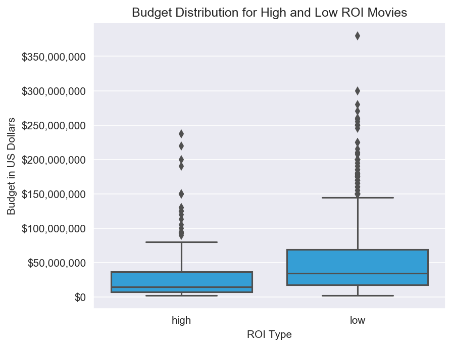
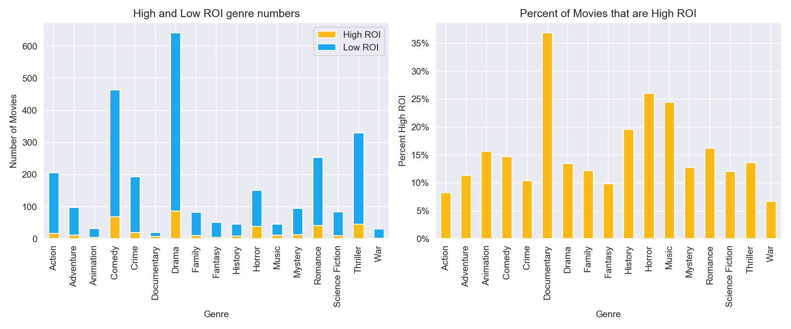

# Microsoft Movie Studio Recommendations

**Author**: Cindy


## Overview

This project analyzes the inital steps needed to get the software company, Microsoft, started in the movie industry. Movie data from The Movie Database (TMDB) shows that movies with budgets of \\$37 million and less are more likely to have a high return on investment (ROI), than high movies with higher budgets. Of movies with budgets of \\$37 million and less, Documentaries are the most likely to have a high ROI. There are 9 directors in Internet Movie Database (IMDB) who have had at least 2 popular documentaries in the last ten years; Alex Gibney, Sam Dunn, Scot McFadyen, Fisher Stevens, Adam Curtis, Peter Mortimer, Joshua Oppenheimer, Josh Lowell, and Boris Malagurski. This initial analysis of movie data will give Microsoft direction in deciding the budget, genre and director for their first movie.


## Business Problem

As a company who is hoping to break into the movie business, Microsoft will need to first focus on the questions most relevent to getting started. Among the initial analysis needed are the questions of budget, genre of movie, and director. These all need to be decided in the first steps of creating/planning the first movie. I believe we should focus on starting small with a high return on investment so the company can grow to a point where it can take more risks.


## Data

This project uses two datasets. The first one was obtained from kaggle and contains 5000 movies from The Movie Database. It includes movie titles, budgets, revenues, vote averages and numbers, genres, languages, keywords and release dates. For this dataset, I am mostly interested in the budgets, revenues and genres of the movies to determine what budgets and genres have the highest return on investment.

The second dataset is a combination of several datasets from IMDB. The IMDB datasets include movie titles, release dates, genres, average ratings, writers and directors. In this dataset, I will use the movie genres, ratings, and directors.

## Methods

This project uses descriptive analysis to find out what types of movies are mostly to yeild a high return on investment. This provides useful information for Microsoft to get started in the movie business.

## Results

High ROI movies tend to have lower budgets than low ROI movies. The middle quartile range is \\$8-37 million.


Documentaries, Horror, Music and History movies are most likely to yeild a high ROI.


## Conclusions

**This analysis leads to three recommendations for Microsoft's first movie:**
* Aim for a budget in the range of \\$8-37 million. This range has the greatest change to have a large ROI.
* Create a documentary. Documentaries are the mostly likely movie genre to have a large ROI and fit well with Microsoft's image. They can leverage relationships with the Bill & Melinda Gates Foundation or Paul Allen's Experience Music Project to find fascinating stories to tell.
* I identified 8 possible directors who have created popular documentaries in the last 10 years. This would be a great place to explore relationships.

    
**Next Steps:**
* If the type of documentary film is decided, I would redo the director analysis looking specifically for directors with experience in that sub-genre (music, history, etc).
* There are many more decisions to be made for this movie that could be further explored in this data, including movie runtime, release date and identifying writers.

## For More Information

Please review our full analysis in [our Jupyter Notebook](./movie_analysis.ipynb) or our [presentation](./Movie_Presentation.pdf).

For any additional questions, please contact **name & email, name & email**

## Repository Structure

Describe the structure of your repository and its contents, for example:

```
├── README.md                           <- The top-level README for reviewers of this project
├── movie_analysis.ipynb                <- Narrative documentation of analysis in Jupyter notebook
├── Movie_Presentation.pdf              <- PDF version of project presentation
├── data                                <- Both sourced externally and generated from code
└── images                              <- Both sourced externally and generated from code
 -- scratch_notebooks                   <- Jupyter notebooks used for initial analysis
```
